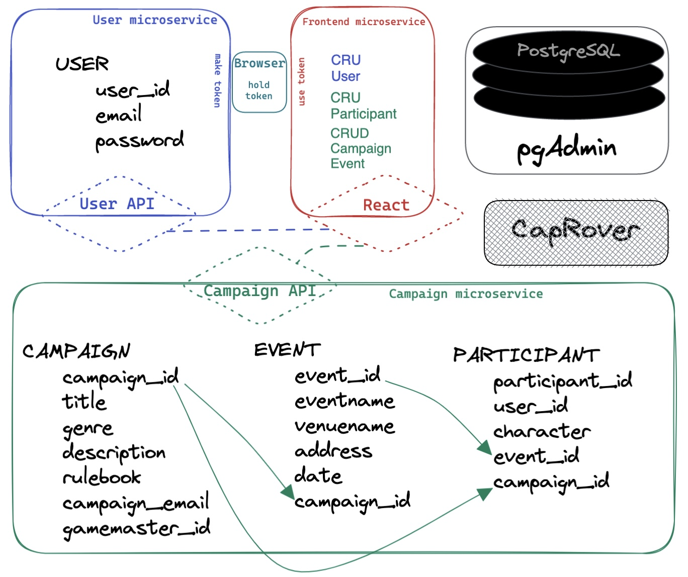

**Team 9** | Andrew, Patrick, Nate, Sean and Brian <br />

# Monomyth
The app for larping. For game masters, Monomyth streamlines the creation and management of campaigns and events. For game players, it allows for fast and easy character creation and event registration. <br />


## Table of Contents

Project services<br />
Users microservice<br />
Campaigns microservice<br />
React components<br />
How to run this application<br />
How to rebuild the database<br />
Application diagram<br />
API documentation<br />
<br />


## Project Services
- **React** binds to port "3000:3000"<br />
Open [http://localhost:3000] to view the React frontend.<br />
- **Users-API** binds to port "8000:8000"<br />
Open [http://localhost:8000] to access the Users backend.<br />
- **Campaigns-API** binds to port "8001:8000"<br />
Open [http://localhost:8001] to access the Campaign backend.<br />
- **pgAdmin** binds to port "8082:80"<br />
pgAdmin is the project's management tool for the database.<br />
- The database is **postgres**, which binds to port "15432:5432".<br />


## Users microservice

**User model**<br />
This model represents a user of the project. It tracks their user id number, email, and password.<br />


## Campaigns microservice

**Campaign model**<br />
This model represents a larp. It tracks the larp's id number, title, genre, detail, a url for the rulebook, an email for the gamemaster, and the user id number of the gamemaster.<br />

**Event model**<br />
This model represents an event of a larp. Larp campaigns are composed of their events. The model tracks the event's id number, name, venue, address, date, and the associated larp's campaign id number.<br />

**Participant model**<br />
This model represents a user's character at the larp. Participants can sign up for events. The model tracks their participant id number, the user's id number, their character's name, the id number of the campaign, and the event id of the event they are registered to attend (if any).<br />


## React components

**SignUpForm**<br />
Form | User enters their email and password. On submit the field data is posted to User API and a token is created for the current User, logging them in. <br />

**Login**<br />
Form | User enters their email and password. On submit, a token is created for the current User, logging them in.  <br />

**Logout**<br />
Deletes token for the current User. <br />

**UserDetail**<br />
Displays the email of the currently logged in user. <br />

**CampaignForm**<br />
Form | User enters title, genre, detail, campaign_email, and rulebook. On submit, the field data is posted to Campaign API and gamemaster_id is set to user_id for the current User. <br />

**CampaignEdit**<br />
Form | Only accessible if logged in user's user_id equals Campaign.gamemaster_id. User can update title, genre, detail, campaign email, and/or rulebook. On submit, the field data is put to Campaign API. <br />

**CampaignList**<br />
Gets all Campaigns and displays each one's title, genre, detail, campaign email, and rulebook.<br />

**CampaignDetail**<br />
Gets title, genre, detail, email, and rulebook for a Campaign. It also displays the associated Events for that Campaign and renders a button to register for that Event. If you are the gamemaster of the Campaign, it renders buttons to create, update, or delete associated Events. It also displays eventname, venuename, address, and date for each Event associated with that Campaign.<br />

**EventForm**<br />
Form | Only accessible if logged in user's user_id equals Campaign.gamemaster_id. User enters eventname, venuename, address, and date. On submit, the field data is posted to Campaign API and campaign_id is set to the campaign_id of the associated Campaign.<br />

**EventEdit**<br />
Form | Only accessible if logged in user's user_id equals Campaign.gamemaster_id. User can update eventname, venuename, address, and/or date. On submit, the field data is put to Campaign API. <br />

**ParticipantForm**<br />
Form | User enters a character name. On submit, that name, event_id, campaign_id, and user_id is posted to Campaign API.<br />


## How to run this application

1. Fork or clone the project from https://gitlab.com/monomyth1/monomyth <br />

2. Build volumes in docker:
    ```
    docker volume create postgres-data
    docker volume create pg-admin
    ```
3. Build services based on the docker-compose.yml:
    ```
    docker-compose build
    ```
4. Bring up all services:
    ```
    docker-compose up
    ```
<br />


## How to rebuild the database <br />

1. Stop and remove all running containers:
    ```
    docker-compose down
    ```
2. Remove the images:
    ```
    docker image prune -a
    ```
3. Remove the volumes:
    ```
    docker volume rm postgres-data
    docker volume rm pg-admin
    ```
4. Rebuild the volumes:
    ```
    docker volume create postgres-data
    docker volume create pg-admin
    ```
5. Bring up services again:
    ```
    docker-compose up
    ```
<br />

## Application Diagram
<br />

<br />


## API Call Documentation

**USERS API**<br />

**Get User by ID** | GET | url endpoint<br />
    Gets the information for a single User. The return value of creating and getting a User is its id, email, and password:<br />
```
    {
        "id": 1,
        "email": "Malia.Ngo@unsong.gov",
        "password": "Shem haMephorash"
    }
```
<br />

**Create User** | POST | url endpoint<br />
    Creating a User requires the User's email and password:<br />
```
    {
        "email": "Malia.Ngo@unsong.gov",
        "password": "Shem haMephorash"
    }
```
<br />


**CAMPAIGNS API**<br />

**Get Campaign by ID** | GET | url endpoint<br />
    Gets the information for a single Campaign. The return value of creating, updating, and getting a Campaign is its id, title, genre, detail, rulebook and contact email:<br />
```
    {
        "id": 1,
        "title": "Unsong",
        "genre": "Apocalyptic",
        "detail": "In retrospect, there had been omens and portents. Rivers flowed uphill. A new star was seen in the night sky. A butchered pig was found to have the word OMEN written on its liver in clearly visible letters.",
        "rulebook": "https://unsongbook.com/",
        "campaign_email": "Aaron@unsong.gov"
    }
```
<br />

**List Campaigns** | GET | url endpoint<br />
    Gets the information for all Campaigns:<br />
```
    {
        "campaigns": [
            {
                "id": 1,
                "title": "Unsong",
                "genre": "Apocalyptic",
                "detail": "In retrospect, there had been omens and portents. Rivers flowed uphill. A new star was seen in the night sky. A butchered pig was found to have the word OMEN written on its liver in clearly visible letters.",
                "rulebook": "https://unsongbook.com/",
                "campaign_email": "Aaron@unsong.gov"
            },
            {
                "id": 2,
                "title": "Doomsday",
                "genre": "Scifi",
                "detail": "Galactic Empires rise and fall. When Old Earth died and humanity took to the stars, their Celestial Ascendency claimed dominance within a scant few centuries. Their rule lasted for nearly 500 years...",
                "rulebook": "https://doomsdaylarp.com/rules/",
                "campaign_email": "Jeramy@doomsdaylarp.com"
            }
        ]
    }
``` 
<br />

**Create Campaign** | POST | url endpoint<br />
    Creating a Campaign requires the its title, genre, detail, rulebook, and contact email:<br />
```
    {
        "title": "Dead Legends",
        "genre": "Western",
        "detail": "In an alternate 1965, the south has freed the slaves, allied with the British, and won the Civil War. With the Union on the backfoot, gold has been found in The Dakotas...",
        "rulebook": "https://deadlegendslarp.com/rulebook/",
        "campaign_email": "Erica@deadlegendslarp.com/"
    }
```
<br />

**Update Campaign** | PUT | url endpoint<br />
    To update a Campaign, send title, genre, detail, rulebook, and/or contact email:<br />
```
    {
        "genre": "Horror",
        "rulebook": "https://deadlegendslarp.com/rulebook2/"
    }
```
<br />

**Delete Campaign** | DELETE | url endpoint<br />
    Deletes the Campaign for the provided URL.<br />
<br />

**Get Event by ID** | GET | url endpoint<br />
    Gets the information for a single event. The return value of creating, updating, and getting an Event is its id, eventname, venuename, address, date, and campaign_id:<br />
```
    {
        "id": 68,
        "eventname": "Puts All Heaven in a Rage",
        "venuename": "Citadel West, Colorado Springs",
        "address": "Cheyenne Mountain",
        "date": (1999, 12, 21),
        "campaign_id": 1
    }
```
<br />

**List Events** | GET | url endpoint<br />
    Gets the information for all Events:<br />
```
    {
        "events": [
            {
                "id": 68,
                "eventname": "Puts All Heaven in a Rage",
                "venuename": "Citadel West, Colorado Springs",
                "address": "Cheyenne Mountain",
                "date": (1999, 12, 21),
                "campaign_id": 1
            },
            {
                "id": 35,
                "eventname": "The Voices of Children in His Tents",
                "venuename": "Citadel West, Colorado Springs",
                "address": "Cheyenne Mountain",
                "date": (1982, 02, 14),
                "campaign_id": 1
            },
            {
                "id": 12,
                "eventname": "The Holiday Special",
                "venuename": "Blue Mountain Lake YMCA",
                "address": "115 Mountain Ave, Hamburg, PA 19526",
                "date": (2016, 12, 09),
                "campaign_id": 2
            }
        ]
    }
``` 
<br />

**Create Event** | POST | url endpoint<br />
    Creating a Event requires the its eventname, venuename, address, date, and campaign_id:<br />
```
    {
        "eventname": "The Full Moon Event",
        "venuename": "Camp Bashore",
        "address": "160 Moonshine Rd, Jonestown, PA 17038",
        "date": (2017, 07, 07),
        "campaign_id": 3
    }
```
<br />

**Update Event** | PUT | url endpoint<br />
    To update an Event, send eventname, venuename, address, and/or date:<br />
```
    {
        "eventname": "Rise of the Warewolf Queen",
    }
```
<br />

**Delete Event** | DELETE | url endpoint<br />
    Deletes the Event for the provided URL.<br />
<br />
